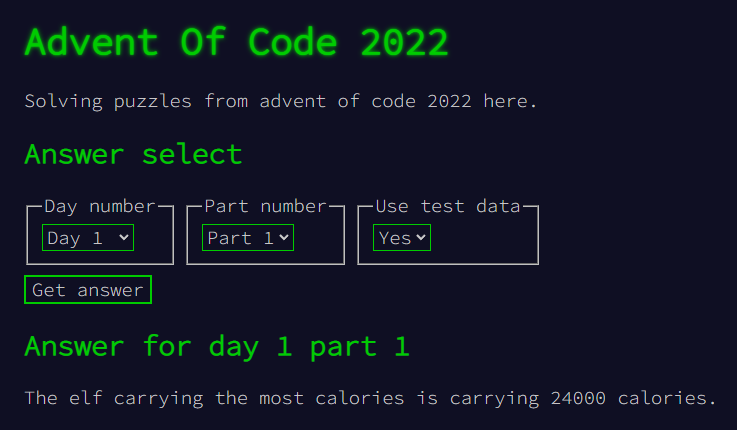

[](https://github.com/mentosmenno2/advent-of-code-2022/actions)

# Advent Of Code 2022

I'm attempting to solve puzzles from advent of code 2022.

https://adventofcode.com/2022

I use the PHP language for solving these puzzles.

## Calculating an answer

### Via CLI

To calculate an answer, run the following command in your command line interface, from the repo root:

```sh
php index.php [dayNumber] [partNumber] [useTestData]
```

For example day 4, part 2, using test data:
```sh
php index.php 4 2 1
```

### Via webbrowser and PHP webserver

If you are a person who likes a little more color, or finds terminal windows scary, this is for you.

Just start a PHP webserver, and in your browser navigate to the `index.php` file. You should be greeted with an interface. If not, you did something wrong, sorry!


